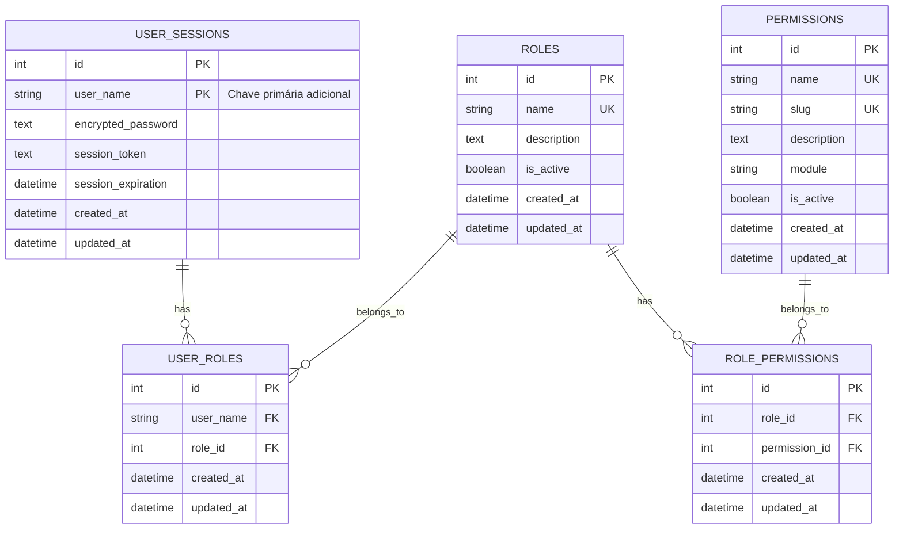
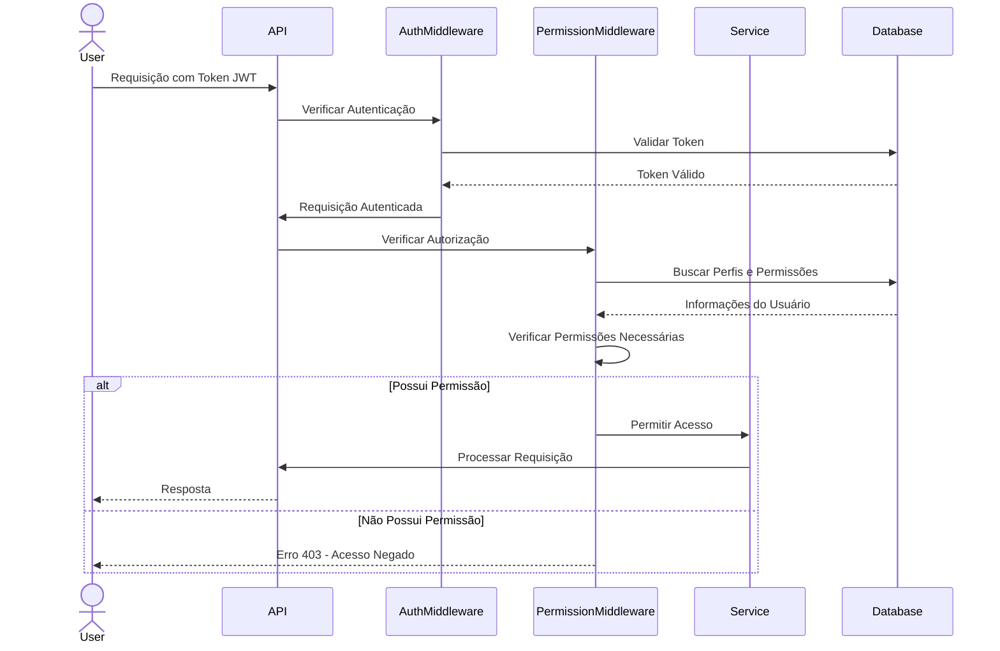
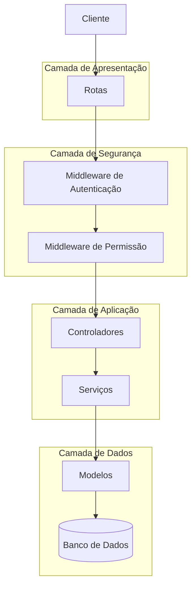
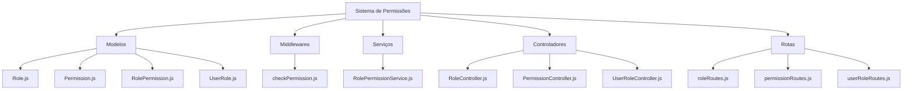

# Diagramas do Sistema de Permissões

Este documento contém diagramas que ilustram o funcionamento do sistema de permissões e perfis do ConabPlus.

## Modelo de Dados

## Fluxo de Autorização

## Arquitetura de Camadas

## Árvore do Sistema de Permissões

